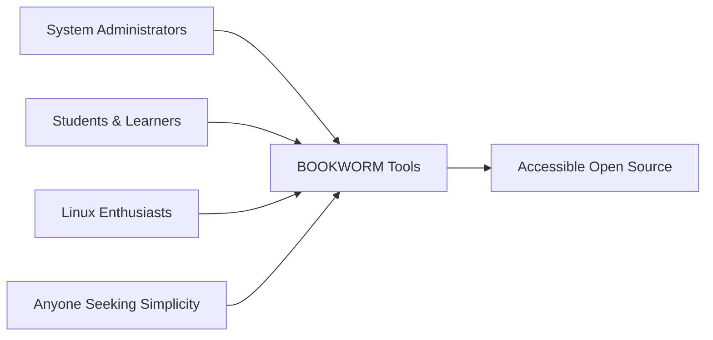

# 📚 BOOKWORM
*From Complex to Simple*

<div align="center">


**Transforming the intricate puzzle of open source into accessible solutions**

[](LICENSE)
[](CONTRIBUTING.md)
[](https://github.com/yourusername/bookworm)

</div>

---

## 🎯 Philosophy

Just like a **bookworm** methodically digests complex texts to extract their essence, BOOKWORM transforms complicated open source technologies into simple, user-friendly tools.

> **Our mission: Make the complex, simple.**

---

## 🌟 The Journey

Open source is powerful but often intimidating. Advanced technologies like kernel compilation, VPN configuration, or system administration require deep expertise that creates barriers for newcomers and even experienced users seeking efficiency.

### How BOOKWORM bridges this gap:

<table>
<tr>
<td align="center"><strong>🧩 Decomposing</strong><br/>Breaking complexity into manageable steps</td>
<td align="center"><strong>🤖 Automating</strong><br/>Eliminating repetitive tasks</td>
<td align="center"><strong>🎨 Simplifying</strong><br/>Intuitive interfaces for advanced operations</td>
<td align="center"><strong>🌍 Democratizing</strong><br/>Making pro tools accessible to everyone</td>
</tr>
</table>

---

## 🛠️ Projects

Each project follows the BOOKWORM philosophy: take something complex, understand it thoroughly, then rebuild it as something anyone can use.

### 🚀 Current Projects

<div align="center">

| Project | Description | Status |
|---------|-------------|---------|
| **🐧 KernelCustom-Manager** | Kernel compilation made accessible | ✅ Released |
| **🔒 StrongSwan-Easy** | IPSec VPN configuration simplified | 🚧 In Development |
| **📦 More tools** | Additional simplification projects | 💡 Coming Soon |

</div>

---

## 👥 Target Audience

<div align="center">



</div>

- **🔧 System administrators** seeking efficiency
- **📚 Students** learning Linux and open source  
- **💡 Enthusiasts** wanting advanced features without the learning curve
- **🌟 Anyone** who believes technology should serve people, not the other way around

---

## 📋 Design Principles

<div align="center">

| Principle | Description |
|-----------|-------------|
| **👤 User-First** | Every tool starts with "How can we make this easier?" |
| **🚫 No Assumptions** | Never assume prior knowledge |
| **🛡️ Safe by Default** | Built-in safeguards and rollback capabilities |
| **📱 Portable** | Works wherever you need it |
| **🔍 Transparent** | Clear about what's happening under the hood |

</div>

---

## 🐛 The BOOKWORM Way

<div align="center">

```
📖 Study → 🧠 Understand → 🔨 Simplify → 🚀 Deploy
```

</div>

Like the patient bookworm that consumes knowledge page by page, we:
- **📖 Study** complex technologies thoroughly
- **🔍 Identify** the essential patterns  
- **🚧 Remove** unnecessary barriers
- **✨ Create** tools that "just work"

---

## 🤝 Contributing

<div align="center">

**The BOOKWORM philosophy extends to collaboration**

[](https://github.com/yourusername/bookworm/graphs/contributors)
[](https://github.com/yourusername/bookworm/issues)
[](https://github.com/yourusername/bookworm/pulls)

</div>

Whether you're:
- 🐛 Fixing a bug
- 💡 Suggesting a feature  
- 🌟 Sharing an idea
- 📝 Improving documentation

All contributions help simplify open source for everyone.

---

<div align="center">

## 💫 Philosophy in Action

*"The best technology is invisible technology."*

**Making the complex simple, one tool at a time.**

---

<sub>Built with ❤️ by the BOOKWORM community</sub>

</div># BOOKWORM - From Complex to Simple

*Transforming the intricate puzzle of open source into accessible solutions*

## Philosophy

Just like a bookworm methodically digests complex texts to extract their essence, BOOKWORM transforms complicated open source technologies into simple, user-friendly tools.

Our mission: **Make the complex, simple.**

## The Journey

Open source is powerful but often intimidating. Advanced technologies like kernel compilation, VPN configuration, or system administration require deep expertise that creates barriers for newcomers and even experienced users seeking efficiency.

BOOKWORM bridges this gap by:
- **Decomposing complexity** into manageable steps
- **Automating repetitive tasks** 
- **Providing intuitive interfaces** for advanced operations
- **Democratizing access** to professional-grade tools

## Projects

Each project in this repository follows the BOOKWORM philosophy: take something complex, understand it thoroughly, then rebuild it as something anyone can use.

### Current Projects

- **KernelCustom-Manager** - Kernel compilation made accessible
- **StrongSwan-Easy** - IPSec VPN configuration simplified
- *More tools coming soon...*

## Target Audience

- **System administrators** seeking efficiency
- **Students** learning Linux and open source
- **Enthusiasts** wanting to use advanced features without the learning curve
- **Anyone** who believes technology should serve people, not the other way around

## Design Principles

1. **User-First**: Every tool starts with "How can we make this easier?"
2. **No Assumptions**: Never assume prior knowledge
3. **Safe by Default**: Built-in safeguards and rollback capabilities
4. **Portable**: Works wherever you need it
5. **Transparent**: Clear about what's happening under the hood

## The BOOKWORM Way

Like the patient bookworm that consumes knowledge page by page, we:
- Study complex technologies thoroughly
- Identify the essential patterns
- Remove unnecessary barriers
- Create tools that "just work"

## Contributing

The BOOKWORM philosophy extends to collaboration. Whether you're fixing a bug, suggesting a feature, or sharing an idea, all contributions help simplify open source for everyone.

---

*"The best technology is invisible technology."*  
*Making the complex simple, one tool at a time.*
